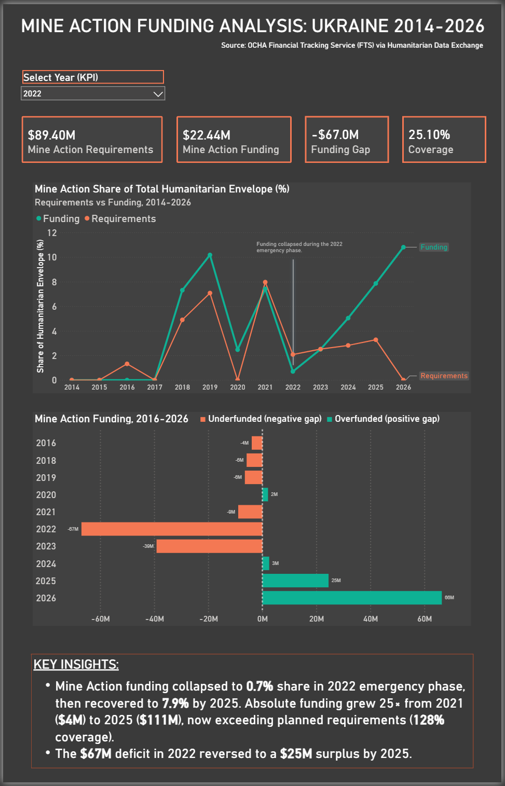

# Ukraine Mine Action Funding Analysis

Power BI dashboard analyzing Mine Action funding in Ukraine (2014-2026) using OCHA FTS data.

---

## What I Built

Interactive dashboard with two pages:
- **Page 1:** Mine Action funding trends (requirements vs actual funding)
- **Page 2:** All humanitarian sectors comparison (where Mine Action fits in)

**Tools:** Power BI, PostgreSQL, SQL  
**Data:** OCHA Financial Tracking Service

---

## Preview

### Page 1: Mine Action Analysis

### Page 2: All Sectors Overview

---

## Key Findings

**1. Mine Action funding grew 25× from 2021 to 2025**
- 2021: $4M (33% of requirements)
- 2022: $22M (25% - emergency collapse)
- 2025: $111M (128% - now overfunded)

**2. Most sectors remain underfunded**
- Food Security: 31% of requirements
- Emergency Shelter: 36%
- Mine Action is one of few exceeding plan

**3. Donor fatigue visible**
- 2022 peak: $1.86 billion
- 2025: $1.20 billion (-36%)

---

## Files

- `dashboard.pbix` — Power BI file (interactive)
- `sql/` — Data preparation queries
- `images/` — Screenshots

---

## How to View

**Download** [dashboard.pbix](./dashboard.pbix) and open with free [Power BI Desktop](https://aka.ms/pbidesktop)

**Features:**
- Year slicer (2014-2026)
- Dynamic KPIs
- Conditional formatting

---

## What I Learned

- SQL queries (CTEs, JOINs, aggregations)
- Power BI dashboards (DAX measures, slicers, formatting)
- Working with humanitarian data
- Data storytelling

---

## Data Source

[OCHA FTS via HDX](https://data.humdata.org/dataset/ukr-requirements-and-funding-data)

**Note:** FTS tracks UN-coordinated appeals. Additional funding may flow through bilateral programs not shown here.

---

## Contact

Nikita Shamaiev  
[LinkedIn](https://linkedin.com/in/nikita-shamaiev)
